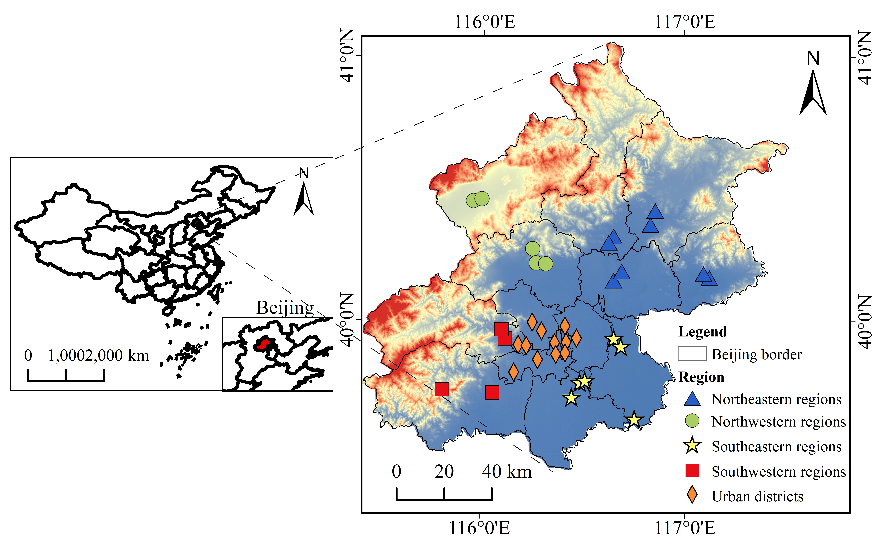

# RegressionAnalysis-SCI-Codes
Open access code resources for the paper: [Regression model and method settings for air pollution status analysis based on air quality data in Beijing (2017–2021)](https://link.springer.com/article/10.1007/s41060-023-00415-7)

## Datasets

1. beijing.csv

  Original data crawled by the spider, air quality and related pollutant data of Beijing from 2017 to 2021.

2. DataAnalysis.csv

  Processed data with added labels. A "Flag" column is created based on the "Quality Level" column, marking as 1 or 0 based on "Whether Polluted".

## Main
The folder contains the following files:

1. AirQualityDetection.pyproj

  A file generated by Visual Studio 2019 IDE.

2. AirQualityDetection.sln

  Solution file of Visual Studio 2019 IDE.

3. AirQualityDetection.py

  A Python web crawler program, used to crawl air quality and related pollutant data for a specific city in a specific year.

4. LinearRegression.py

  Linear regression Python program.

5. LogisticRegression.py

  Logistic regression Python program.

6. DataVisualization.py

  Visualize the datasets.

## Code Description
1. AirQualityDetection.py

  A Python web crawler program, used to crawl air quality and related pollutant data for a specific city in a specific year. After running, input the city (in pinyin) and year as prompted by the code.

2. LinearRegression.py

  Linear regression Python program. After running, it outputs the read dataset, slope and intercept of the linear regression fitting curve, coefficient of determination of linear regression and polynomial regression to the console, and plots scatter plots of PM2.5 and NO2, training and testing results of linear and polynomial regression.

3. LogisticRegression.py

Logistic regression Python program. After running, it outputs the read dataset, coefficient of determination of L1 and L2 regularization to the console, and plots the relationship between "Whether Polluted" and PM2.5 and NO2, the relationship between the number of iterations and the loss function, and the impact of L1 and L2 regularization on training and testing accuracy in line charts.
